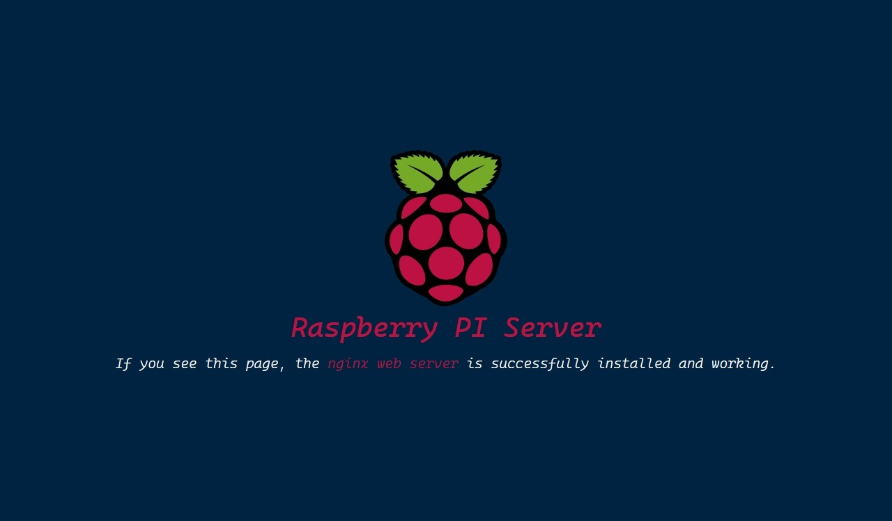

# RPI Nginx Page

A nice simple custom nginx page for your Raspberry PI.

## Preview

  

## How to use

First, compile the assets using NPM. If you don't have [Node](https://nodejs.org/en/), then you need to install it.

```PowerShell
npm run build
```

Move the output files (`dist/**/*`) to your nginx page directory (commonly `var/www/html`) and enjoy it.
